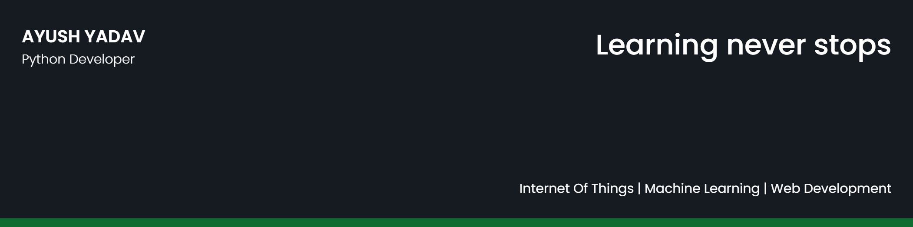

## 🧔 About Me

- 🔭 I’m currently working on **PyQt5 & FPGA design for embedded systems**

- 🌱 I’m currently learning **Azure and Tensorsflow **

- 👯 I’m looking to collaborate on **Python/Arduino projects**

## 🤝 Connect

